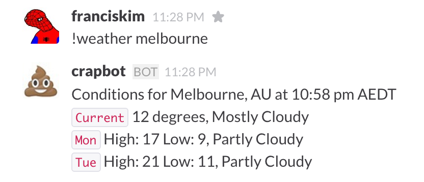

## slackweatherbot
### Slack Weather Bot
#### Uses the Yahoo weather API via HTTPS to return the weather of a specified location/city to your Slack chat, using the RTM API.



###### Step 1
You first need this bot running on your Slack chat: https://github.com/xBytez/slackbotapi/ 

###### Step 2
Once you have your bot running off your script similar to [example_bot.js on the xBytez repo](https://github.com/xBytez/slackbotapi/blob/master/examples/example_bot.js), install the slackweatherbot via npm:
```(sudo) npm install slackweatherbot```

###### Step 3
Require the module in your bot script:
```
var slackweatherbot = require('slackweatherbot');
weatherBot = new slackweatherbot();
```

###### Step 4
Within the [switch statement](https://github.com/xBytez/slackbotapi/blob/master/examples/example_bot.js#L41) place the following code:

```
case "weather":
    var location = command[1];
    weatherBot.getWeather(location, function (err, message) {
        if (message) slack.sendMsg(data.channel, message);
    });
    break;
```

###### Step 5
The module should work as per the screenshot above.
